# Development process

This document walks through development of the [living book][https://scsru.github.io/Test_SCCRBook/]. Each section contains necessary code, with any required modifications mentioned.  Sections contain general goals, subsections highlight when to do it, and sub-subsections are merely for your information if you want to learn more about it or there is some problem.

Throughout this, there are often may ways to do something. I tried to include the most common, ordering them in way may be the simplest for people not used to using GitHub, but feel free to use any method.

If you ever have any problems, feel free to reach out!


# Git Setup

This part may already be complete if you have used GitHub before, and is also outlined in the readme file. The point on this section is to install the necessary software to work with the book (beyond that found in R).


## Software Installation

You will need Git installed on your computer. If you are running a Mac or Linux computer, this may already be done! However, you can still follow the instructions if unsure. For everyone else, to download it, there are two options.
- If you are new, and want a nice application to use, try GitHub Desktop. This helps working with both GitHub and the language Git. Install it at the [website](https://desktop.github.com/) and it should walk you through the installation. (I will update this section with more instructions in the future).
- Alternatively, you can download the Git software directly. This is found on the [Git site](https://git-scm.com/downloads), and has instructions on installation for your computer.


# Package Connection

This section is made to get the book on your computer and ensure you are also add information to the remote server.


## First Time Setup

After opening the [github page](https://github.com/scsru/Modules), there are three main ways to download the project to your computer, outlined below. Please use whichever one you are most comfortable with.
- If you installed GitHub Desktop on your machine, on the github page, click the '<> Code' button and select 'Open with Github Desktop'. 
- Right click in the desired location on your computer and open git bash. Type 'git clone <URL>' where <URL> indicates the the https url retrieved on the github page, clicking the green '<> Code' button. This URL should be 'https://github.com/scsru/Modules.git'.
- Right click in the desired location on your computer and open git GUI. Select 'Clone Existing Repository' and enter the git <URL> in Source Location. This <URL> is retrieved on the github page, by clicking the green '<> Code' button ('https://github.com/scsru/Modules.git'). Enter your desired location on the computer in Target Directory.

### Additional Information

This step is called cloning a repository (or repo for short) and creates a copy of the online hosted package on your computer. Because of this, you can change things on your computer and then when everything is working, push changes to the remote server for others to access (discussed in a later section).

One possible issue is that GitHub says you do not have access or fails on clone. In this case, you may be on a computer where your Github credentials were not setup. Open Git Bash as try:
```{bash, eval=FALSE}
  git clone https://<URL Previously Retrieved>
```
You should be prompted on connecting an account.


## Subsequent Uses

While you may have previously cloned the repository, others may have made changes and updated it since you copied it. Because of this, it is good practice to always 'pull' the project before working on it to ensure you are using an up-to-date version. You can do this in one of the follow ways:
- Using GitHub Desktop: In the folder of the project, it should have a nice option for pulling the project. (Currently I do not have it setup on this test computer, so I will add to this later with detailed instructions) 
- Using Rstudio. Often when you open a project that has been connected to GitHub, RStudio will recognize it and at the top left, another tab near environment and history will be called Git. There is a blue arrow in this tab with the words pull next to it. (Currently I do not have it setup on this test computer, so I will add to this later with detailed instructions) 
- In the project folder, right click and open git GUI. Go to 'branch > update' in the top options.
- In the project folder, right click and open git bash. Enter 'git pull'.

### Additional Information

Pulling a repo is done regularly to ensure you work on the latest version of codes. Generally this will be sufficient; however, it is possible to write some code and then pull if someone has pushed new information since you started. This will typically work normally, but if the changes that 'conflict' or interact with your changes, GitHub may ask about it. In this case, we need to do a 'merge' where we look at the differences and choose which changes to keep (which may be both if we determine they do not actually interact).


# Local Project Development 

This section is all about ensuring everything is correct on your computer to begin development. 


## Location

Open the 'Modules.Rproj' file to ensure you are in the right location.

## Package Setup

We use the package renv to version packages of the code and prevent breaks by unexpectedly running different versions.

The following code gets the currently included libraries and versions. Run
```{r, eval=FALSE}
renv::restore()
```
You may need to install renv. If this is your first time using renv, you could get a message like given below, which asks you to activate the project. Say yes (or 1 depending on the version). If you have used it, but this is your first use on this project, you may only get the second message.
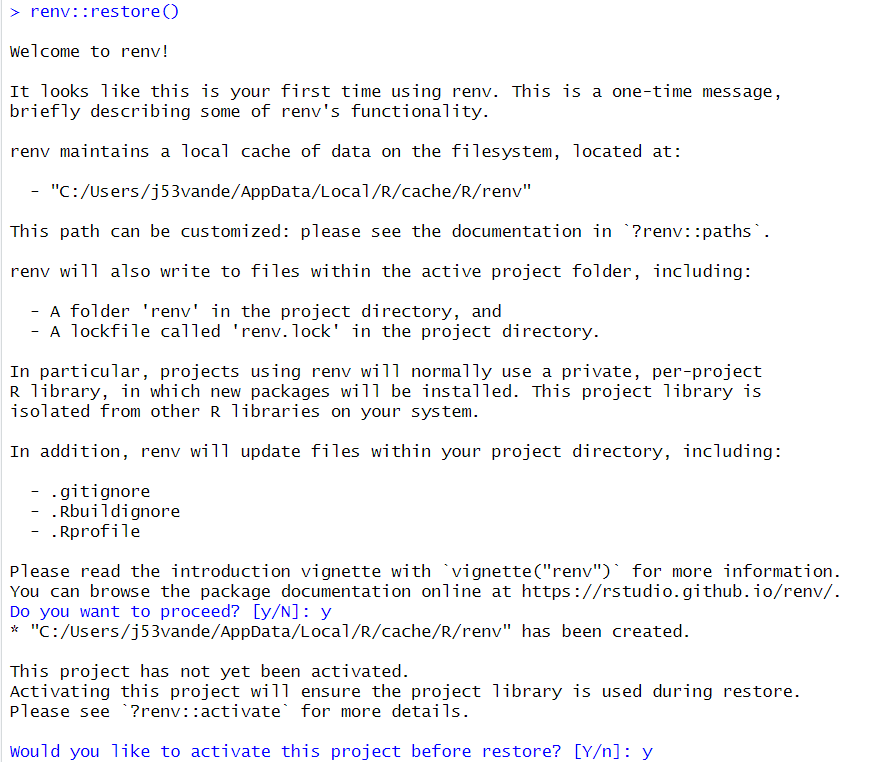

Restore all of the libraries. The first time you do this, a lot of packages will be listed and you are asked to restore it. Note, this may happen after the last messages.
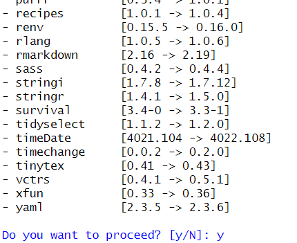


## (Optional) Compile Check

This optional check is done later, but I recommend it to check if anything is broken before you make changes. You don't want to think you broke something when it was already broken!

Run the following code to compile and serve (or load) book in a local browser.
```{r, eval=FALSE}
bookdown::serve_book()
```

### Additional Information

This stage is finicky. If you get weird failures for basic libraries or just have issues, try updating R! This is the most common often the issue at this point.
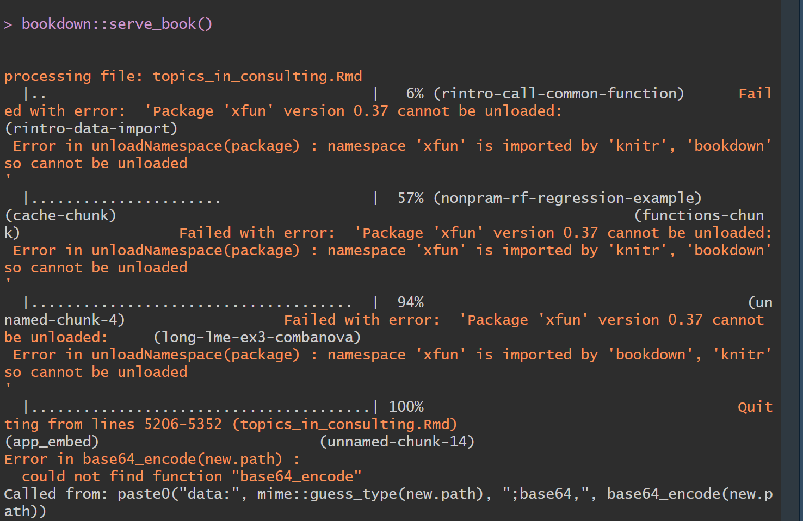
If a small package is broken, you can try to update it or re-restore the renv environment. 
```{r, eval=FALSE}
renv::update()
```
Proceed when asked, we can always fix it if a package is better when not updated.

Due to the nature of this step, if none of the given suggestions work, the best advice is to reach out.


## Development

It is finally time for development by adding or changing modules. It is good practice to develop on a new GitHub branch so it is easy to understand what you are doing and not mix up potential issues if something isn't working. This can be done as:
- GitHub Desktop: There should be an option to create a branch. I will add more information when I have a different computer nearby.
- Git GUI: Right click in project, select git GUI and select 'branch > create'. Follow any prompts.
- Git Bash: Right click in project, select git bash and type 'git checkout -b <newBranchName>' which create and moves to the branch.

It is a good idea to check which branch you are on in GitHub Desktop, Git, or RStudio.

Make any changes to the project (including changes to 'references.bib'). If any new libraries are needed in the renv, Rstudio will act as if it has never been installed. For example, you may see a yellow bar above the code.
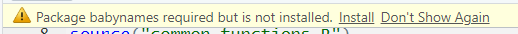
You can just use 'install.packages("<package>")' which will call the renv command renv::install("<package>")'. If in doubt, feel free to install!

In order to add the new module in the book, add a '  - "<filename>" ' in the desired placement below:
```{r update_contents}
file_contents <- paste0(
  '
new_session: no
delete_merged_file: true
book_filename: "topics_in_consulting.Rmd"
rmd_files:
  - "index.Rmd"
  - "mod_intro_r.Rmd"
  - "mod_ggplot2.Rmd"
  - "mod_linear_regression.Rmd"
  - "mod_generalizedlinearmodels.Rmd"
  - "mod_nonparametric.Rmd"
  - "mod_longitudinal.Rmd"
  - "mod_questionnaire_design.Rmd"
  - "mod_sample_size.Rmd" ')
```
and then run the following code, which adds a few development sections then outputs the results in a .yml file for the book creation.
```{r update_devcontents, eval=FALSE}
dev_contents <- 
  paste0(file_contents,'  
  - "app_general_guidelines.Rmd"
  - "app_formatting_guidelines.Rmd"
  - "app_git_tutorial.Rmd"
  - "app_bookdown_tests.Rmd"
  - "Z_references.Rmd" ')

write(dev_contents,"./_bookdown.yml")
```

### Additional Information

A common mistake is to forget references in 'references.bib', so be sure to double check that!


## Test Code

To check the code, the first step is to see if it works locally. This can be done using the following code, which may take awhile on first compilation:
```{r, eval=FALSE}
bookdown::serve_book()
```
If there are not errors, the code should open a viewer in RStudio and give a link that you enter the given address into any web browser for a locally hosted version. You may stop the code using
```{r, eval=FALSE}
servr::daemon_stop(1)
```
which is given and noting that the 1 may change if you have multiple instances running without closure.

### Additional Information

If you see no error, but the hosted book does not include your new module, you probably forgot to include the file in the previous string and run the code to save it.

If you mistyped the name, then you will see an error like follows.
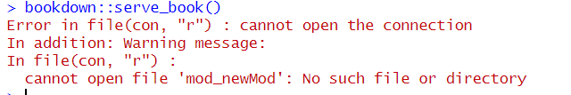

If you forgot to install (or restore) a package, the following error may be displayed
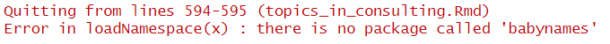

# Send Changes to Server

This section focuses on preparing and sending changes to the remote server.


## Save Environment

Any additional or changed packages need to be recorded for consistency with other developers and to inform GitHub what is needed to host the book. 

Save all changes with
```{r, eval=FALSE}
renv::snapshot()
```

If no packages were added or updates, you will get the following result.
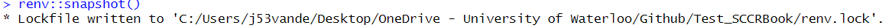

If packages were added, removed, or updated, you will get a result similar to the following.
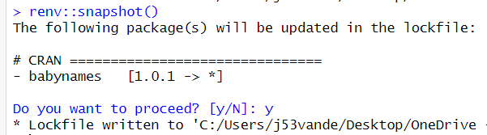

It is recommended to only update packages that must be updated for functionality as some may have been downgraded for GitHub server reasons.

### Additional Information

The package information is saved in 'renv.lock', which can be directly modified.


## Prepare for GitHub

This step we do a last verification of the code and also remove the development sections of the book. Be sure the file_contents variable is correct in the development section as we now write that information without development sections in a .yml file for the book creation.
```{r update_finalcontents}
dev_contents <- 
  paste0(file_contents,'  
  - "Z_references.Rmd" ')

write(dev_contents,"./_bookdown.yml")
```

It may also be useful to check the code, again using the code
```{r, eval=FALSE}
bookdown::serve_book()
# When you want to stop
servr::daemon_stop(1)
```

## Push to GitHub

When the book works locally and you have saved the environment, it is time to push all changes to the GitHub server. There are several steps to this: stage (this specifies which changed files you wish to send to GitHub), commit (this gives a nice message and prepare the files to be send to GitHub), and push (this pushes all commits to GitHub). You can do these steps using GitHub Desktop, RStudio, or git directly.
- GitHub desktop should have some nice buttons. I will add more on this later.
- RStudio should have some nice buttons. I will add more on this later.
- If you use git GUI, you have several options, but generally click file icons from the top part to bring them into the staged area, write something in the commit message section and press commit, then press push.
- If you use git bash, on your branch, you stage changes ('git add .' will stage all changes), commit ('git commit -m "<message>" ' will commit changes with some message from you), and push ('git push' will push changes to GitHub). There may be a comment about creating a branch online when you push, but the code will be given if needed (see next figure for pushing a branch I made locally called 'fixReadme'). These steps will get your code online, where you can PR into dev.
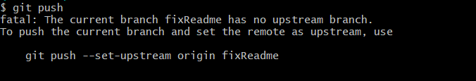

### Additional Information

You can push to any branch except main. Pushes to main will fail! More discussion on getting your changes into production in later sections.


## Check GitHub

When you push to GitHub, GitHub actions will automatically check to see if there are any issues in creating the book on the server. You can monitor the progress in the Actions tab, results on the branch (which are small), or see the result if the branch is part of a pull request (discussed later).

A check is excellent news! Any red X is a failure. Looking at the steps should offer information to find the issue. Some common errors may occur in the following steps:
- Setup R Environment: An error in this step likely requires upgrading or downgrading a package.
- Build Site: An error in this step likely indicates that you forgot to include the package in the 'renv.lock' file. Run 'renv::snapshot()' in the local environment and re-push.

### Additional Information

Even if there are no errors, this will not be in production--i.e. the online book--yet. 


# Publish Changes

You may have noticed, no changes are visible on the online book yet. There are still a few steps, which are covered below.


## Merge With Dev

We want to prepare your changes to get to production. The first thing to do, if you didn't code on it, is to merge your code into the dev branch. This will make sure any other changes are incorporated and check that all is working.

It is good practice to merge your branch with the dev branch using a pull request (PR). Although it doesn't need to be approved at this step, using a PR will remind you if the checks fail. 

You can do this on the GitHub page, where near the top is the Pull requests tab and in there a green button called new. There you select a branch and where is should go, be sure to watch the arrows.

On a PR, you change ensure the code is passing all internal checks. 
- A check in progress looks like the following on a PR.
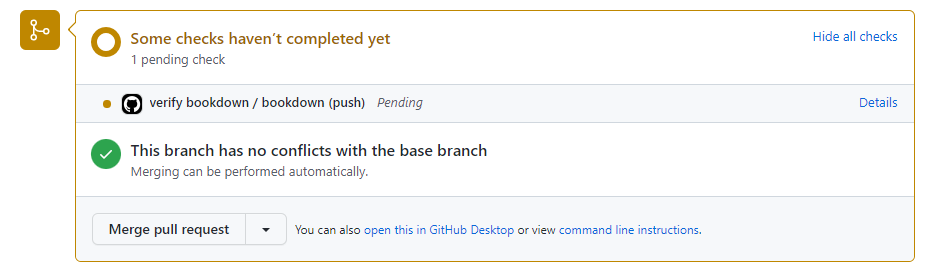
- Passing the tests will get you a result like the following.
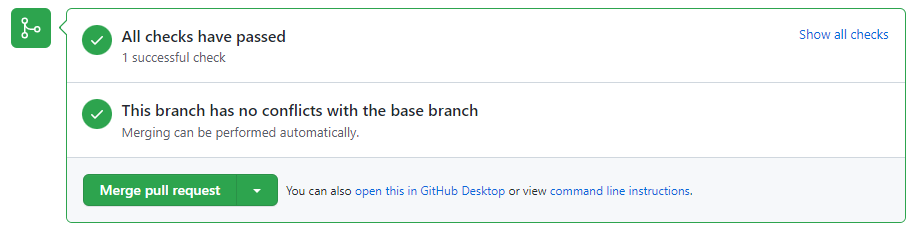
- (I will add a failure example)

### Additional Information

Merging may require you making local changes and re-pushing to GitHub. Any new pushes on the branch will automatically be included in the merge.

Merge to dev when you have no errors and test the results. Again, this will not change the published book.


## Merge Dev to Main

This step will send all changes in the development version to the production version. When it is decided that we should do so, a pull request for dev to main is made. This is similar to previous PRs and the same checks apply. Note, if you try to directly push into main, there will be an error (below is an example in Git Bash). You must use a pull request.
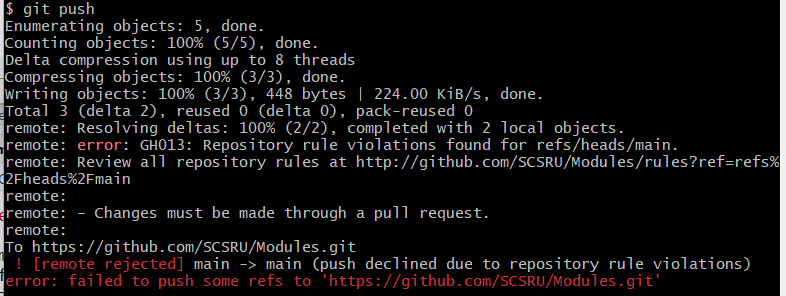

However, you can not immediately accept a PR into main. It requires approval from another person, so be sure to include them in the PR and add informative comments on the PR. If you do not have approval yet, you will see the following where you normally merge.
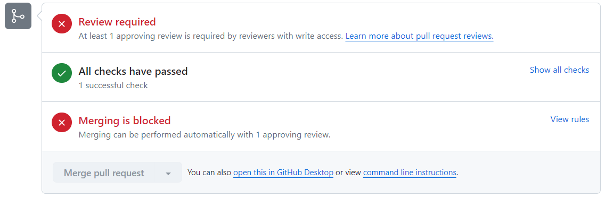

You can set any reviewer(s) at the top right of the page, as shown below.
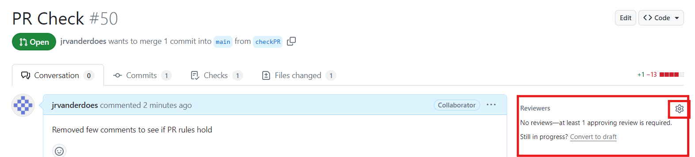
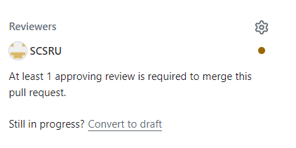

A reviewer may get notified (depending on settings), but upon entering the PR will see a banner near the top.
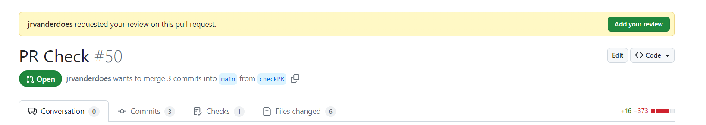
The reviewer can then look at the code and add comments, require changes, or approve the PR.


Once accepted, the reviewer will likely merge with main. However, you also have the ability to do so. Upon merging dev to main, github actions will check the code again and publish the results to the book. You can verify the progress in the actions page. After completion, if you go to the website and don't notice changes, be sure to refresh the page and/or wait a few minutes.


# Tips for Using This File 

Once you have read this file, you may feel comfortable with the development process and only want to use this to get the code for running different formats of the book. Search (Ctrl-f in windows) for "update_contents" for the code where you define the new modules. This must be run before the next two options: search for "update_devcontents" for the development version code and search for "update_finalcontents" for the final version code. Then run "bookdown::serve_book()" to check the book.
