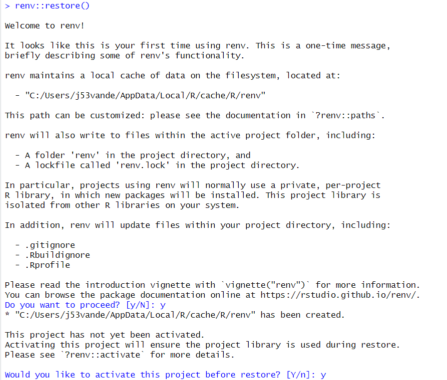
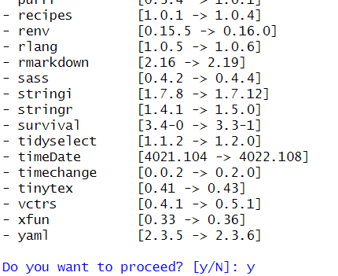
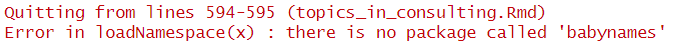
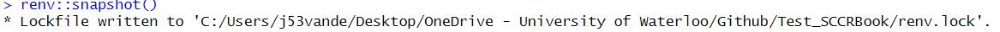
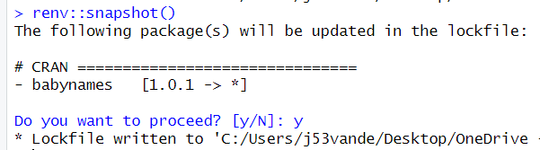
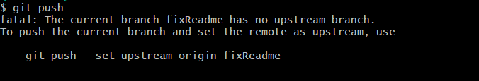

Welcome! 

This is the test version of automating the SCCRU book publishing process.

As a developer, this repo can be used very similar to that done previously. However, since there are a few process changes, I have outlined the steps below.

**1. Pull the project**
- This means you need to update/clone the Github repo onto your computer to make changes from GitHub. 
For the first time working with this project, there are several ways to do this. After opening the github page ("https://github.com/jrvanderdoes/Test_SCCRBook"): 
  1. If you have git installed on your machine, right click in the desired location and open git bash. Type 'git clone \<URL\>' where \<URL\> indicates the the https url retrieved on the github page, clicking the green '\<\> Code' button. This URL should be 'https://github.com/jrvanderdoes/Test_SCCRBook.git'.
  2. If you have git installed on your machine, right click in the desired location and open git GUI. Select 'Clone Existing Repository' and enter the git \<URL\> in Source Location. This \<URL\> is retrieved on the github page, by clicking the green '\<\> Code' button ('https://github.com/jrvanderdoes/Test_SCCRBook.git'). Enter your desired location on the computer in Target Directory.
  3. On the github page, click the '\<\> Code' button and select 'Open with Github Desktop'.
- After cloning it, whenever you want to work on the project, be sure to pull the project to work on the newest version. This is done (after installing git on your machine, https://git-scm.com/downloads ):
  1. In the project folder, right click and open either git bash or git GUI. Use 'git pull' in bash. If you are unfamiliar with git, please reach out!
  2. Using Rstudio. Currently I do not have it setup on this test computer, so I will add to this readme later with detailed instructions.
 
**2. Setup Project**
- This means ensuring everything is properly setup. Open the "Test_SCRBook.Rproj" file in RStudio. 
- Ensure all packages are properly versioned by running 'renv::restore()'. This will set up the saved libraries and versions.
  - If this is your first time using renv, you will get a message like given below. If you have used it, but this is your first use on this project, you may only get the second message.
 
  
  

 
  - Restore the start of all the libraries. A lot of packages will be listed and you are asked to restore it. This may happen as part of the previous step.
 
  
  

 
  - If you get any errors at this state, reach out. I can help update the lockfile so we can get it working again!
 
**3. Write/Update Module Files**
- This step you will change or add new modules. 
- It is good practice to create a new branch in git to make the changes to. If you right click the folder and use git bash, type 'git checkout -b \<newBranchName\>'. Feel free to reach out if you have questions on creating and modifying other branches.
- When creating files be sure to add the newfile to '_bookdown.yml'. This file lists the chapters of the book *in order*. So you will type '- "\<Mod Name\>.Rmd" '. 
- Also be sure to include references in 'references.bib'.
- If any new libraries are needed in the renv, Rstudio will act as if it has never been installed. For example, you may see a yellow bar above.

  
  

 
You can just use 'install.packages("\<package\>")' which will call the renv command renv::install("\<package\>")'. If in doubt, feel free to install!

**4. Test Module Files**
- This step is about testing module files and the enviroment for errors.
- See if the book compiles and see it locally hosted using 'bookdown::serve_book()'. This may take a long time the first time, but eventually it should open a webpage with the (locally) hosted book.
- There are many errors this step may reveal.
  - If you see no error, but the hosted book does not include your new module, you probably forgot to include the file in '_bookdown.yml'.
  - If you mistyped the name in '_bookdown.yml' then you will see an error.
 
  
  

 
  - If you forgot to install a package, you see an error like the following.
 
  
  

 
**5. Save Enviroment**
- This step saves the package versions for use on the online server and ensure that we all run the same versions. The results are saved in 'renv.lock'.
- Run 'renv::snapshot()'.
  - If no packages were added or updated, you will get the following result.
 
  
  

 
  - If packages were added, removed, or updated, you will get a result similar to the following.
 
  
  

 
- It is recommended to only update packages that must be updated for functionality as some have been downgraded for GitHub server reasons.
- You can also modify the 'renv.lock' file directly.

**6. Push to GitHub**
- This step pushes all changes to GitHub.
- Here you need to push all your local changes to the remote GitHub repo. Use Git Bash, Git GUI, or RStudio and reach if you are new to Git.
  - If you use git bash, on your branch, you stage changes ('git add .' will stage all changes), commit ('git commit -m "\<message\>" ' will commit changes with some message from you), and push ('git push' will push changes to GitHub). There may be a comment about creating a branch online when you push, but the code will be given if needed (see next figure for pushing a branch I made locally called 'fixReadme'). These steps will get your code online, where you can PR into dev.
 
  
  

  - If you use git GUI, you have several options, but generally click file icons from the top part to bring them into the staged area, write something in the commit message section and press commit, then press push.
  - Also note on your computer, you can push to any branch *except* main. Pushes to main will fail! (But PRs to main will be allowed from any branch. However, they likely won't be approved so be sure to go to dev).
- Upon push, GitHub actions will check to see if there are any issues in creating the book on the server. You can monitor the progress in the Actions tab or see the result if the branch is part of a pull request.
- Exploring the steps of the action, a checkmark indicates a passed step while an X indicates a failure. Looking at the steps, the following errors are possible.
  - Setup R Enviroment: An error in this step likely requires upgrading or downgrading a package.
  - Build Site: An error in this step likely indicates that you forgot to include the package in the 'renv.lock' file. Run 'renv::snapshot()' in the local environment and re-push.
 
  
  

 
- Note, even on no errors, pushing at this stage will not change the published book.

**7. Merge with Dev**
- This step consolidates work by merging your branch into dev.
- It is best practice to merge your branch with the dev branch using a pull request. Although it doesn't need to be approved at this step, using a PR will remind you if the checks fail. 
  - A check in progress looks like the following on a PR.

  
  

  - Passing the tests will get you a result like the following.

  
  

  - (I will add a failure example soon)
- Merging may require you making changes and re-pushing to GitHub. Any new pushes on the branch will automatically be included in the merge.
- Merge when you have no errors and test the results. Again, this will not change the published book.

**8. Merge dev to main**
- This step will merge all changes in dev to main.
- (In the future) This will require approval from some people, so be sure to include them in the PR and add informative comments on the PR.
- Once dev is merged to main, github actions will check the code again and publish the results to the book. 
- You can verify the progress in the actions page. After completion, if you go to the website and don't notice changes, be sure to refresh the page. (Question, do we have a website URL we want to host this at? I can change it to match.)

Let me know if you encounter errors or ways we could make the instructions clearer.
