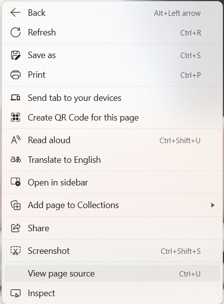
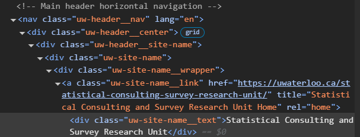

# Introduction to Web Scraping

*Author: Jeremy VanderDoes*

*Last Updated: Jun 2, 2025*

--- 

## Introduction

In this chapter, we discuss web scrapping. Web scrapping is the process of collecting information for the world wide web. Typically this is done programmatically, and the program to do this is sometimes called a bot or web crawler. Web scrapping can be used to parse, format, and save text and images. Web scrapping has been implemented in many projects [@webscrape] and often creates rich data sets. However, it can be time consuming to implement and perfect. Python is often considered the standard programming language for web scraping and has strong packages to support the task; however, recently R has begun to be increasing used. 

In this module, we cover main concepts in web scrapping and give a brief overview of R implementations before devoting the majority of our discussion to Python implementations.

### Web Scraping Considerations

We remind readers here that web scrapping is typically legal when the data is public, non-personal, and factual. However, it is wise to consider the sites that will be scrapped beforehand. Although the most reliable source is contacting a lawyer, a general overview can be found at this [site](https://r4ds.hadley.nz/webscraping#scraping-ethics-and-legalities). See also this [site](https://en.wikipedia.org/wiki/Web_scraping) which states '... web scraping may be against the terms of service of some websites, but the enforceability of these terms is unclear.'

Remember to scrape ethically. Web scrapping calls the sites as if you were looking at the site and so doing it too much, e.g. too often and/or too fast, can crash sites or cause other problems. It may seem hard to do that upfront, but it is possible (and often easy) to inadvertently cause problems. Many of us can recall a time when we wanted a new item or concert ticket and as soon as it goes on sale, the website seems to slow or even crash. When programmatically scrapping a web site, typical barriers which slow us down--i.e. reading page, finding the desired link, etc.--are often not a problem. Further, the webpage code can load before it is rendered on-screen meaning that web scrapping can quickly place many requests or calls to the web site. 

A site is ethically scraped when the calls are sent at a reasonable rate. To prevent unethical scrapping, sites often have mechanisms to detect scrapping and may limit or block calls from your computer if it detects scrapping, even when done ethically. Navigating around captchas or other preventative measures can be difficult is left to other works. In general, these is a constant struggle between web sites preventing scrapping and methods designed to overcome obstacles and scrap web sites.

### Web Scraping Principles

To really understand web scrapping, we need to address how web sites are described. Although there are many programming languages to build web sites, web sites are typically described using HyperText Markup Language, referred to as html. Because websites are described using html, a program can be trained or directed to consistently pull information from sites. 

In the html code, cascading style sheets (css) is used to describe elements in the html. Said another way, html describes the way the site is laid out while css is used to add styling to elements on the page. For example, html may place a title at the top of the page but css describes size and color of the element.

If you open a page on a web browser then right-click there will an option that says something along the lines of "View page source".

{height=50%}

Selecting page source will open a page similar to the following (but much longer).
```{html, eval=FALSE}
<html>
  <head>
    <title> Web scraping in R and Python </title>
  </head>
    
  <body>
    <div id="div_name">
      <h1 id='info_title'>A heading</h1>
      <p> Information </p>
      <p> More information </p>
      
    </div>
  </body>
    
</html>
```

A hierarchical structure is used in html such that elements of some 'tag'--e.g. head, h1, p, img, li, etc.--have a starting form \<tag, ...\> where additional attributes can be added at the ..., an ending form \</tag\>, and contents that are all the other elements between the start and end tag. There are hundreds of html elements, but typically only a few are needed to start. In fact, you don't even need to understand what a tag means to scrape it! However, it can help to understand the code, so some common elements include:

- *Required elements*: The element <html> starts all html pages. It has two elements inside it: <head> which contains general information and <body> which contains the content observed on the web page. Note that elements that are directly inside element A are called children of the element A. Children of those (and their children, etc.) are more generally called descendants.
- *Block tags*: Tags that define general groups on the page. This includes headers (<h#> where '#' indicates the level of the header, e.g. using \<h1\>), sections (\<section\>), paragraphs (\<p\>), lists (\<li\> among others), and so forth.
- *Inline tags*: Tags to format text inside blocks. Examples include bold (\<b\>), italics (\<i\>), and links (\<a\>).

Attributes in tags can be nearly anything. Common ones include 'name', 'id', and 'src'.

While the page source can be useful for seeing the entire html document, often this is hard to navigate. Instead, it is perhaps more common to right click and select 'Inspect'. This will bring up an interactive panel with html code and css styles. The html code relating to the inspected element should be highlighted, but some browser require that you 'inspect' the element again after the panel is open. The html code can also be panned and the related element will be highlighted on screen.

When a specific element is desired on the page, inspect can lead you to the correct place as well as the methodology to get that element. If you right click on the html code there are several options, but an important one is 'copy' which allows you to copy the code path needed to get to that element. This can speed up scrapping on many sites. However, we add an aside here to note that if the webpage is developed using more modern methodology, the html code may shift each time the page is loaded. In this case, more care is needed to ensure reliance on stable code.

A page's html could be navigated using an element attribute or id. Another option is a path of elements, similar to the file structure on computers. A path language such as XML Path Language (XPATH) may be used to do this. For the title of the SCSRU center website, the full XPATH is copied at the time of writing this code as:
```{html, eval=FALSE}
/html/body/div[3]/div/header/nav/div[1]/div/div/div/a
```
The path starts with html, similar to starting with the C drive of many computers. The symbol '/' deliminates each child element examined. See later sections for variations of navigating paths. Full paths can be difficult to read. An alternative method is to use code that looks for specific elements. For example, the title is located in an element with an attribute class that is unique, 'uw-site-name__link'. It is often more reliable to have code look for unique identifiers such as this. Even when the desired element does not have a unique identifier, if a nearby parent (element owning it) or sibling (nearby element in the same parent) has a unique identifier, it can simplify web scrapping; see later sections.

Note that if you scroll on html code in the inspection panel, it is not uncommon for multiple elements to seemingly describe the same thing and highlight the same element on screen. For example with the title, there is a \<div\> with the text, \<a\> with the link, and several class giving various information. Often when scrapping, different elements can be used for the same effect and some are more accessible than others.


## R Web Scrapping

A basic web scrapping package in R is `r cran_link("rvest")`. Although scrapping has been extended in other packages such as `r cran_link("RSelenium")`, this section focuses on `r cran_link("rvest")`. A useful reference for the introduction to web scrapping in R using `r cran_link("rvest")` is [R for Data Science](https://r4ds.hadley.nz/webscraping).

To scrape, first a link to the desired web page is required. This can be nearly any web page. It is often the base page of a site, and other pages can be navigated from there. In this R tutorial, we focus on scrapping a single page. An important note is that some websites are dynamic, or they don't load elements until they are visible. In this case `r cran_link("rvest")` is typically insufficient. We leave the discussion of such sites in R to other works, but consider it in the Python section below.

The html code of a web page can be obtained as follows.
```{r, eval=FALSE}
url <- 'https://uwaterloo.ca/statistical-consulting-survey-research-unit/'
html <- rvest::read_html(url)
```

Various commands exist to parse, or read, the information in html code. For example, the following code returns the elements in the body of the html code.
```{r, eval=FALSE}
html_element(html,'body')
```

We could find a specific child using commands such as
```{r, eval=FALSE}
html_children(html_element(html,'body'))[1]
```

Alternatively, the entire html element could be converted to text and natural language processing techniques used:
```{r, eval=FALSE}
html_text2(html)
```

We end our discussion in R at this point. However, the information in the next section can be adapted to R. In particular, we investigate Selenium in Python and many methods have been adapted for R in `r cran_link("RSelenium")`.


## Python Web Scrapping

Traditionally Python has been a major language for web scrapping. Using the selenium package, a webpage can be opened in a web browser by 
```{python, eval=FALSE, python.reticulate = FALSE}
driver = selenium.webdriver.Edge()
```
for Edge. Other browsers can also be used, and testing the browser is important when scrapping. Anti-bot measures can be broken or easier to avoid on different browsers. Additionally, for more stubborn sites (e.g. those that detect and prevent the use of web scrappers) the package `undetected_chromedriver` may be useful.
```{python, eval=FALSE, python.reticulate = FALSE}
driver = undetected_chromedriver.Chrome()
```
By default, these codes open the web browser on screen. This can be useful for testing code or even required for some dynamically loaded sites, but settings which prevent the visual loads are also available. 


The defined 'driver' controls the browser session. Hence this is the start of most calls. Closing the driver (`driver.close()`), waiting long enough for a time out, or directly exiting the browser requires restarting the driver to continue scrapping. The driver can be used to navigate to a url with the code
```{python, eval=FALSE, python.reticulate = FALSE}
driver.get(url)
```
where url is a string, e.g. 'www.google.com'. Additionally, interacting with the webpage manually--e.g. entering a url yourself at the top of the browser--is typically effective.

Other actions can done by using driver. For example, finding an element on the page can be done using `driver.find_element()`. In order to use the function, we must consider `selenium.webdriver.common.by` which we will call `by` for convenience. The command has methods to use such as `by.CLASS_NAME`, `by.ID`, `by.XPATH`, and so forth. In conjunction, these codes allow navigation of the html code to specific elements on the page which can then be analyzed for the desired data. For example on the SCSRU website, one element with the main title has a unique class 'uw-site-name__link'. 



The title element can be scrapped with the following code.
```{python, eval=FALSE, python.reticulate = FALSE}
elem = driver.find_element(
	selenium.webdriver.common.by.CLASS_NAME,
	"uw-site-name__link"
       )
```
Information such as text or link of the element can then be extracted.
```{python, eval=FALSE, python.reticulate = FALSE}
elem.text
elem.get_attribute('href')
```

Another common way to find elements would be using XPATH. 
```{python, eval=FALSE, python.reticulate = FALSE}
elem = driver.find_element(
	selenium.webdriver.common.by.XPATH,
	"//div[@class='uw-site-name']/div/a"
       )
```
This code highlights important properties of a path. We start at the html, and look into further elements using forward slashes. This is akin to most computers starting with the C drive ('C:/' in files). A '/' means only a child (i.e. one level below) the element. On a computer this means only look at folders directly in this folder. However, folders inside those folders are not searched. When we do not know how far down the element is, a '//' is useful as it searches all descendants (and hence we suppressed the first html step above). This would be like looking in all folders and any folders contained in them. After a slash, the word describes the type of element, such as div or a, as previously discussed. Square brackets can be used for additional information. A '[0]' would return the first example, while '[\@class='STRING']' only returns the element where the class equals 'STRING'. There is much more to learn for pathing, but most problems can be solved with these simple commands.


Sometimes to investigate a web page, cursor movement needs to be simulated. For example, a mouse may need to hover or click on something. This can be done using `ActionChains` which is imported from `selenium.webdriver.common.action_chains`.
```{python, eval=FALSE, python.reticulate = FALSE}
ActionChains(driver).move_to_element(elem).click_and_hold().perform()
```

The actions of `driver.find_element()` or `driver.find_elements()` immediately tries to find an element. This can be a problem in automation because the code will often run faster than a web page can load. If the web page isn't loaded, the code will return an error. The can be frustrating as the code is generally correct but needs more time. One potential solution is having the code wait, but this requires correctly guessing the right amount of time. If the guess is too low, the code will fail, and if it is too high, the code will take longer than necessary. An alternative solution uses `WebDriverWait` from library `selenium.webdriver.support.wait` and `expected_conditions` from `selenium.webdriver.support`, denoted as `EC` below.
```{python, eval=FALSE, python.reticulate = FALSE}
elem = WebDriverWait(driver, EXPLICIT_WAIT_TIME).until(
            EC.visibility_of_element_located((By.XPATH,'//*[contains(@class,"uw-site-name__link")]'))
        )
```
Up to the user-defined maximum time variable above 'EXPLICIT_WAIT_TIME', the code tries to run. If it runs successfully, the results are returned and the code continues. If it does not, e.g. the web page hasn't loaded yet, the code tries again. This process continues until the code completes or the maximum time is elapsed.  

On retrieved elements, in addition to getting data, you can act on them. For example, an element can be clicked
```{python, eval=FALSE, python.reticulate = FALSE}
elem.click()
```
or other input could be given. For example, for a text input box--e.g. a search bar--the following code enters text then presses enter (where `Keys` is from `selenium.webdriver.common.keys`).
```{python, eval=FALSE, python.reticulate = FALSE}
elem.send_keys('sending text')
elem.send_keys(Keys.ENTER)
```

Data that is saved from elements is typically directly saved (e.g. taking a screenshot by `elem.screenshot('SavePath')`), or put into an objects (`data.frame` in R or `pandas.DataFrame` in Python among others) and saved. When text is saved, Natural Language Processing is often useful to remove extraneous information. We leave this discussion to other works.


## Remarks

Web scrapping is a rapidly evolving field and websites regularly change. This tutorial offers an outline, and key words that can be useful for searching on the web for the most current methods. 

We end this module with a tip to completing a web scrapping project as quickly as possible. It is not uncommon for web pages to change or get better at detecting scraping. It is unfortunate to scrap half a site, then have to reprogram the bot because you took a break for a month or so.


